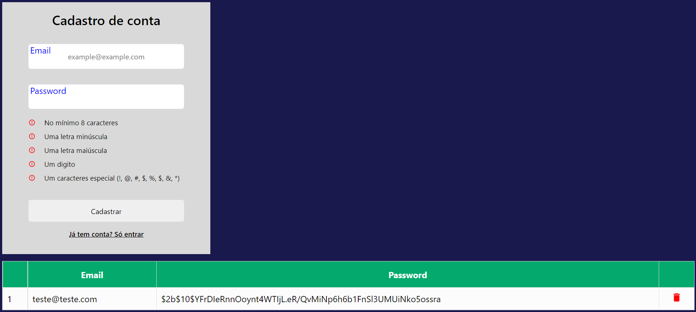
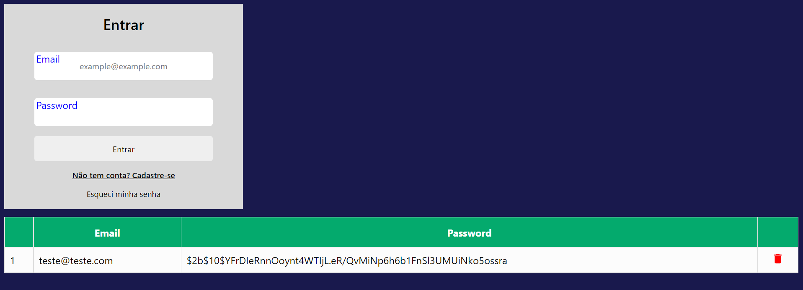

### Sign Up and Login

Testando o Serverless functions do `NextJs`

1. Cadastrar um e-mail com senha.



2. Entrar com o e-mail cadastrado.



#### MongoDB

Criar uma conexão no [cloud.mongodb.com](cloud.mongodb.com)

Criar um projeto e clicar em `Databases`

Clique em `Connect`, `Connect your application` e copiar o link.

Adicionar no root do projeto um arquivo `.env` com: `MONGODB_URI="<link>"` `MONGODB_COLLECTION="<collection>"`

#### Iniciar projeto

```bash
yarn // instalar as dependências
yarn dev // Iniciar

```
